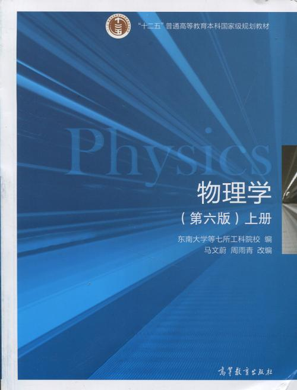
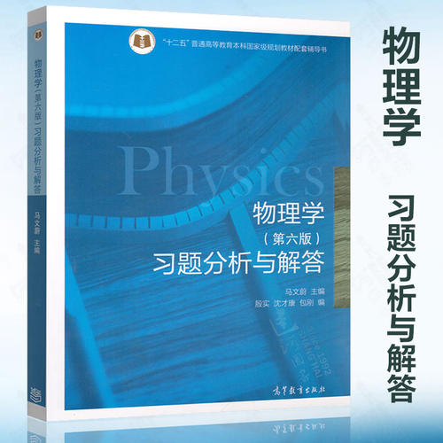

# 物理概论
 

## 课程内容：
- Chapter 1-质点运动学
- Chapter 2-牛顿定律
- Chapter 3-守恒定律
- Chapter 9-振动
- Chapter10-波动
- Chapter11-光学（期末不考）
- Chapter12-气体动理论
- Chapter13-热力学基础
- Chapter14-相对论
- Chapter15-量子物理
- 其他的根本不学，学的每章也很水，只考前几节

## 考核方式
- 百分制考查课
- 平时成绩10'
- 单元测试30'
- 期中测试20'
- 期末测试40'

平时成绩主要看到勤和作业 
- 到勤
  - 王刚老师比较严格
  - 何砚发老师人特别好，缺勤一次扣1分，这部分尽量不要丢分
- 作业 
会有至少一次收作业，作业一般来说是祖传的那些题，题和答案在我这个项目里都有，自己注意完成时间，字好好写，争取得A。

单元测试一共三次，在SPOC里完成，自己做，有题库，每个人的题不一定一样但差不太多。 
三次的内容是：
- 力学和能量。这次有不少填空题，需要精确计算。
- 振动和波动。
- 分子动理论和热力学。记得网上好像很多都能搜到。

千万要小心谨慎，很多人只错一个题，一定不要暴毙在这里。

期中测试其实就是近代物理（相对论和量子物理），SPOC完成，仔细点做就行。

期末考试是40分，8个大题，分数平均分配，线下笔考。
考试内容和课程内容一样：
1. 质点运动学
2. 牛顿定律
3. 守恒定律
4. 振动
5. 波动
6. 气体动理论
7. 热力学基础
8. 相对论/量子物理
